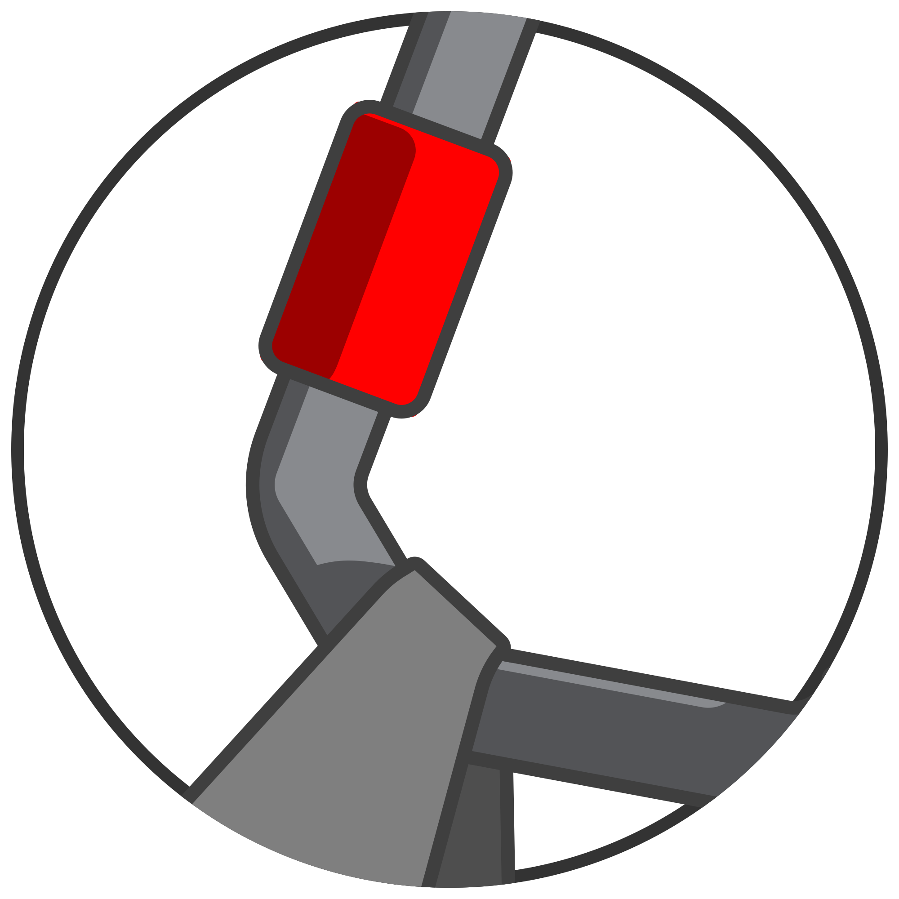

# VSCodium [CDE](https://github.com/wav3m1nd3d/ade-spec/README.md#CDE "Containerized Development Environment Specifications" ) Compose

	<picture>
  		<source media="(prefers-color-scheme: dark)" srcset="docs/images/cde-dark-mini.svg">
  		<source media="(prefers-color-scheme: light)" srcset="docs/images/cde-mini.svg">
  		
	</picture>

	<i>"Comfortable like sitting at home, but your home is actually modular and <b>HOOKED</b> to a helicopter"</i> anon.

# About

This project is a _well automated_ [_**CDE**_](https://github.com/wav3m1nd3d/ade-spec/README.md#CDE "Containerized Development Environment Specification") with seamless [_VSCodium IDE_](https://vscodium.com "VSCodium IDE Website") integration ([_VSCode IDE_](https://code.visualstudio.com "VSCode IDE Website") compatible).

	<h2>Quick Introduction</h2>

A _**C**ontainerized **D**evelopemnt **E**nvironment_, so one that uses technologies like [Podman](https://podman.io/) or [Docker](https://docs.docker.com) and industry de-facto-standards like [compose specification](https://compose-spec.io/) as its abstraction layers to provide a reliable in operation and flexible in configuration basis for cross-platfrom developement ( Linux / Windows WSL2 / Mac ) with a lot more automatizations than usually is given to a developer:

* Single command to setup your projects.
* A new directory, `git subtree add`, and a quick `.env` edit is required to start using this CDE in your workflow.
* GitHub Templates are available for new projects with sane defaults and popular software stacks.
* Add your own software stack without losing ease of use.

_Some **positive** considerations:_

* Doesn't pollute your machine with developent dependencies (that can bork your OS if mishandled), and configurations of software you use for other means.
* Doesn't use your storage as much as minimum of ~30GB per image each virtual machine for a different environment and/or project.
* Native for containerized workloads, and with with a little tinkering can be ported to baremetal Linux.
* Doesn't use as much RAM as a conventional VM solution.

_Some **negative** considerations:_

* Can't easily replicate environments of Mac, Windows, Mobile-native development projects, you better consider something similar to a VM solution, like a [_VDE (coming soon)_]()
* GPU support? (niether the maintainer knows if it's possible and can be automatized)
* Graphics support? (planned, but odds are high that it won't be as bare-metal performance)
* Some basic dependencies are still present _(they better be installed on your machine if you respect your time and your machine)_.

## Use cases

* A microservice
* A linux-native application with scripts to package it for multiple distributions
* 